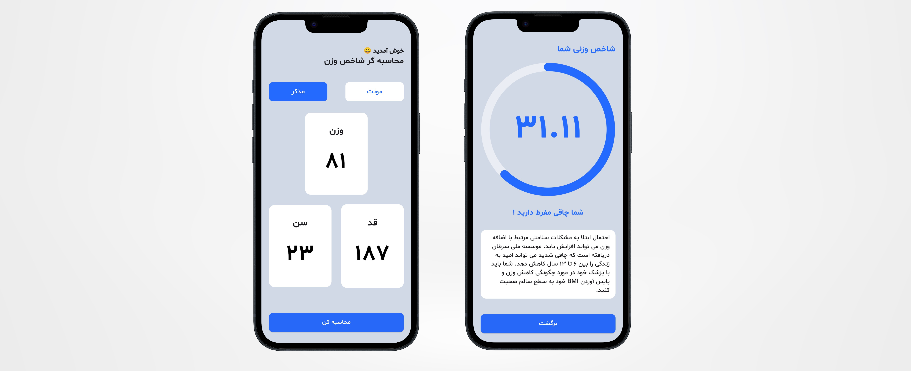

# BMI Calculator 

## Overview 
This is a simple BMI calculator that can track the user's BMI and could give the user some tips about the range he/she is in with simply giving their age, height and weight. The app has been written with dart language and bloc state management has been used to handle the logic of the app and keep the app maintainable and clean. The ui is also responsive for all types of mobile phones.

## Packages Used 
  - hexcolor
  - circular_seek_bar 
  - flutter_screenutil

  
## Technologies Used 
 - Language: Dart
 - Architecture: BLoC

## Project Structure 
The project follows bloc architecture for the separation of layers: 
 - BLoC : To handle the logic and send state for the unique event being received.
 - UI : Infrastructure layer that is aware of the bloc and can send certain events to it.

## Project Setup
To run the application:

 1. Clone the repository.
 2. Open the project in Android Studio / vscode.
 3. Build and run the app on an Android emulator or physical device by your choice.
